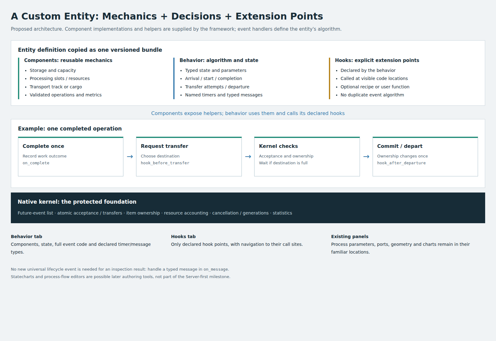
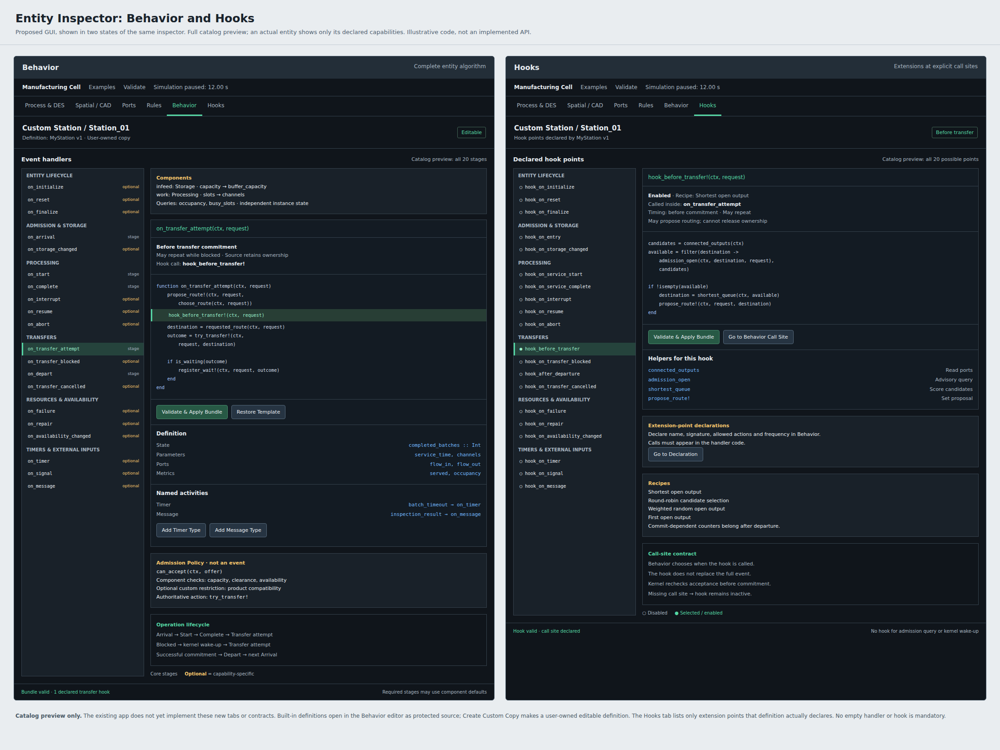
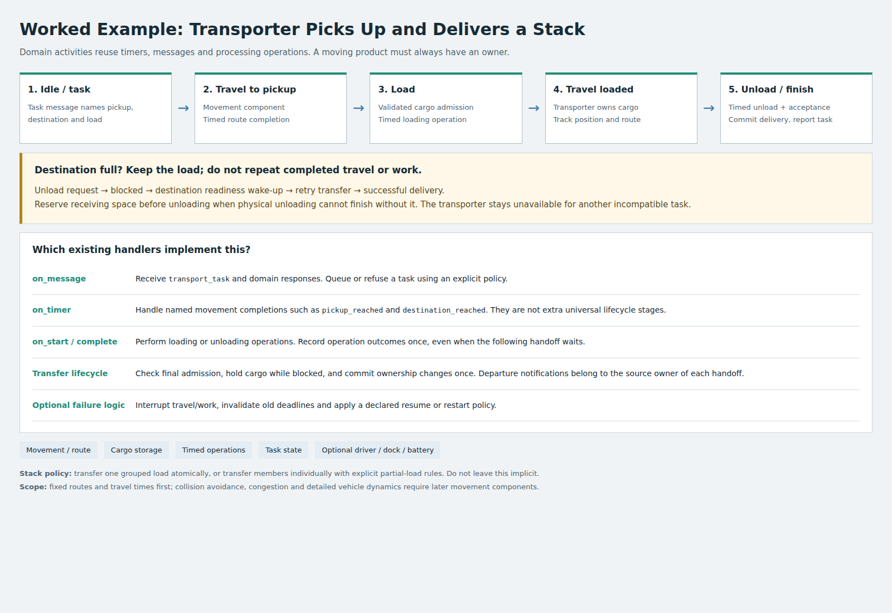

# Plan: Custom Entities Through Compiled Event Handlers

Status: Phase 0 native benchmark harness implemented; compiled behavior framework remains a design proposal.
Updated: 2026-10-02.

## 1. Goals and Agreed Scope

Users should be able to copy an existing entity, inspect its real event algorithm,
edit it, and create a new entity using an event-oriented helper library. The
Behavior and Hooks are separate tabs in the existing entity inspector. Behavior
defines the complete algorithm; Hooks defines optional functions called at
explicit extension points within that algorithm. No separate built-in-code
viewer is needed: the Behavior tab shows the canonical source directly.

Built-in entities will migrate onto the same handler framework, providing one
active source of truth. The first milestone covers the Server, including the
performance spike and GUI. Queue, Source, Sink and Conveyor follow later.

Performance parity is a measured acceptance criterion, not an assumption based
on compilation. Superseded native entity algorithms will be retained as frozen,
deprecated, test-only reference implementations rather than deleted.

### Modified Approach: Component Composition

A complete custom entity is:

**Typed state + parameters + declared components + event handlers + ports +
metrics + declared hook points.**



Components provide reusable mechanics; behavior code supplies decisions and
workflow; hooks extend specific locations within that workflow. This makes the
native-kernel boundary explicit rather than adding a second execution system.
Users still learn events and helper functions, but select the mechanics they
need instead of reimplementing storage, slot counters or transfer accounting.

| Component | Responsibilities | User Behavior Controls |
|---|---|---|
| Storage | Item membership, capacity, enqueue/dequeue and default admission. | Selection, grouping and release conditions. |
| Processing | Operation identity, slots, completion generations and interruption state. | Durations, outcomes and start conditions. |
| Resource access | Valid acquisition/release, subscriptions and availability. | Required resources and arbitration policy where supported. |
| Movement/track | Position, route progress, travel deadlines and supported physical constraints. | Destination and supported speed/mode commands. |
| Cargo | Ownership of a carried load, quantity/capacity and validated loading/unloading. | Grouped versus individual handling and task sequence. |

These are proposed component contracts, not a claim that a general component
framework already exists. Keep derived facts such as occupancy and busy-slot
counts owned by their component, not duplicated as independent user counters.
Expose them as queries/metrics. Component instances have independent typed state;
cross-entity shared resources are referenced through explicit handles.

Declare component names, versions, parameter bindings and dependencies in the
behavior definition. The compiler validates combinations and helper availability,
then assembles a typed bundle rather than introducing dictionary lookups on every
event. For example, a batching station selects Storage and Processing, then uses
`on_arrival` to collect a batch, `on_complete` for outcomes, and a named `on_timer`
timeout for partial batches. No new universal batch lifecycle event is needed.

Adding behavior follows this preference order: use a declared hook for a small
extension; edit an existing handler for algorithm changes; declare a named timer
or typed message for independent future/external activity. Introduce another
universal lifecycle stage only if an existing contract cannot express it.

Statecharts and graphical process flows are possible later authoring tools. If
introduced, they should compile to the same behavior bundle with a defined
editable source of truth, not run through a parallel simulation engine. They
are outside the current implementation milestone.

## 2. Event Model and Native Kernel

An entity consists of declared parameters, typed state, components, ports, metrics
and event handlers. The following core names are proposed. The detailed event contract
below is the design baseline; concrete Julia types/signatures are fixed and
tested in Phase 2 before migration.

| Handler | Responsibility |
|---|---|
| `on_arrival` | Decide how an admitted product is queued or starts processing. |
| `on_start` | Define processing-start actions. |
| `on_complete` | Define the completed-work outcome once and request a transfer. |
| `on_transfer_attempt` | Evaluate a pending transfer, including route selection where the policy permits reconsideration. |
| `on_depart` | Observe a successful departure after destination acceptance. |
| `on_timer` | Handle named timers and custom events. |

`can_accept` is an optional read-only admission policy query, not an event,
behavior lifecycle transition or hook. Its contract is defined separately below.

Acceptance is checked before admission. Completion and departure are distinct:
work can finish while its product remains blocked in the station. Completion
side effects must not repeat on transfer retries. Departure occurs once per
successful transfer. A committed departure notification cannot reroute that
already transferred product; routing belongs before the transfer commitment.

### Lifecycle Completeness

The current engine already performs arrival, processing, blocking, retries and
departure. Its user-facing lifecycle API does not distinguish all those stages:
`on_service_complete` and `on_exit` are currently called together before the
`ProcessComplete` dispatcher, including on completion-event retries. This is
insufficient as the contract for authoring complete custom algorithms. It does
not mean DES requires a separate queued event for every stage below.

Distinguish three concepts: a scheduled DES event advances time, a behavior
handler implements a transition, and a hook is an optional call at a declared
location inside that handler. Several transitions and hooks may execute at the
same simulated timestamp without additional future-event-list entries.

| Stage | Frequency and Contract |
|---|---|
| Admission check | May run repeatedly; a read-only readiness query, not an arrival notification. |
| Admitted arrival | Once per successful admission; destination owns the product. A rejected or waiting offer is not an arrival. |
| Processing start | Once per service operation; schedules or otherwise defines its completion. |
| Processing completion | Once per service operation, even if discharge is blocked; outcomes and completion side effects are not repeated. |
| Transfer attempt / before transfer | Initially and on permitted retries; may propose a destination, but cannot release source ownership. |
| Blocked notification | Once when entering a blocked episode, not once per failed retry. |
| Readiness notification | Wakes a pending transfer; does not guarantee capacity is still available when the sender retries. |
| Transfer commitment | Kernel atomically validates/claims acceptance and changes ownership/accounting. Competing senders cannot use the same slot. |
| After departure | Once following successful commitment; notification only, not a place to reroute the committed product. |

For example, a machine completes at time 10, finds its destination full, retries
at times 12 and 15, and transfers at time 15. Completion fires once at 10;
transfer-attempt logic runs at 10, 12 and 15; the blocked notification fires once;
departure fires once at 15. Destination admission follows the committed handoff
in a deterministic, non-interleaved order defined by the kernel contract.

A chosen destination remains stable unless the behavior explicitly opts into
reselection on retry. Repeated attempts must not redraw product quality or
advance a successful-transfer round-robin counter. Keep candidate selection
separate from committing policy state.

Failure/repair, service interruption/resumption, resource readiness and entity
initialization/reset need contracts as their corresponding features migrate.
Conveyor pulses and accumulation checks use declared timer events. Phase 2 will
publish a capability matrix separating lifecycle transitions, optional
notifications, policy queries and kernel actions. Not every entity must implement
every handler. Audit lifecycle
coverage before migration rather than treating the original six hook names as
a complete universal event model.

Handlers use kernel actions such as enqueue, begin service, finish service,
request transfer and schedule a timer. These are conceptual API names, not a
claim that all helpers already exist.

The kernel retains ownership of the future-event list, product ownership,
capacity accounting, lossless internal transfers, waiting and wake-ups,
statistics and reusable physical components. User handlers cannot release
ownership before acceptance or create duplicate service/departure transitions
through these supported actions. Arbitrary trusted Julia code is not a security
sandbox; direct access to internal mutable structures is outside this contract.

Typed state is declared through the editor and compiled into a concrete runtime
representation. Whether this uses generated structs or typed storage slots is
decided by the spike. Parameters and mutable state are separate, and every
instance has independent state.

### Event Contract: Scope and Context

Here an entity means a behavior-owning model element (machine, belt, source,
buffer or custom component); an item means a product/customer being transported.
A behavior may also represent a resource or controller with no flowing items.

No finite list of named callbacks can anticipate every domain algorithm. Define
a stable core, opt-in capability events and a typed custom-event mechanism.
This supports new discrete-event algorithms within the kernel's ownership and
resource model. Continuous dynamics, distributed synchronization and entirely
new physical constraints require components or extensions, not merely more
callback names.

All handlers receive a typed context and event payload. Common context includes
simulation time, owner/state/parameters, relevant item handles, originating port,
an event identity and a seeded RNG where permitted. Payloads carry the relevant
operation, transfer, timer, resource or correlation identity. Items are optional;
entity-wide events must not invent a dummy product. Handlers return typed
decisions or issue validated kernel actions, never manually edit ownership or
the future-event list.

### A. Entity Lifecycle

| Handler | Trigger | Contract |
|---|---|---|
| `on_initialize` | Instance activated after definitions and connections are available. | Once per activation; initialize declared state and schedule initial work. No implicit arrivals. |
| `on_reset` | Explicit simulation reset. | Cancel/invalidate old activity through the kernel, restore initial state and RNG policy, then initialize the new run. Not used for pause/resume. |
| `on_finalize` | Instance ends or is explicitly removed. | Once with an end reason; cleanup/reporting. Ending a run does not silently destroy remaining items; removing an occupied entity requires an explicit disposition policy. |

### B. Admission Policy, Arrival and Storage

Admission is one kernel mechanism, with an optional custom policy:

| Query/Action | Use | Contract |
|---|---|---|
| `can_accept` | Advisory routing or readiness probe. | Read-only, repeatable, no RNG draws or scheduling. Return Accept, WaitUntil(time), WaitForChange or Reject(reason). Compose mandatory capacity, clearance and availability checks with optional user restrictions; a policy cannot bypass those checks. No event/hook editor is required. |
| `try_transfer` | Authoritative handoff action. | Atomically recheck final admission and commit, wait or refuse. An advisory Accept is not a reservation; another sender may have taken the last slot. |

Ordinary entities inherit admission checks from their declared components. Expose
an advanced Admission Policy section within Behavior only for custom restrictions
such as product compatibility. A refused request returns its reason to the
transfer handler; preserve ownership and require an explicit external-loss policy
to discard an item. No universal `on_admission_refused` event is necessary.

| Handler/Notification | Trigger | Contract |
|---|---|---|
| `on_arrival` | Admission committed to this destination. | Once per transfer/item; destination owns the item. Queue, start an operation, consume explicitly or retain it. |
| `on_storage_changed` | Committed enqueue/dequeue or capacity change. | Optional storage-component notification with old/new occupancy and reason. Kernel emits/coalesces defined changes; the handler must not recursively rewrite the same change. |

Storage-change notifications are opt-in for algorithms that react to occupancy,
such as batch assembly. Simple queues can use enqueue/dequeue helper results
without an extra callback or event-list entry.

Sources create items using a kernel creation action and can drive emission with a
named timer. A source-owned item awaiting admission remains owned by the source.
A sink uses `on_arrival` and an explicit consume/exit action. No artificial
processing-start or processing-complete events are needed for either.

### C. Processing Operations

| Handler | Trigger | Contract |
|---|---|---|
| `on_start` | An operation successfully acquires its required slots/resources. | Once per operation, with its item or item group and operation ID. Define completion timing or custom progress. |
| `on_complete` | The active operation reaches its completion condition. | Once per operation; apply outcomes and request discharge. Retries cannot complete the same operation twice. |
| `on_interrupt` | Active work is paused/preempted by a declared cause. | Once per transition to interrupted; invalidate the previous completion generation and preserve remaining work or apply an explicit restart policy. |
| `on_resume` | Interrupted work reacquires prerequisites. | Once per resume; continue or restart according to the declared policy. Not another `on_start` for the same operation. |
| `on_abort` | An operation is explicitly cancelled. | Once; release its resources and choose a valid disposition for its items. Cancellation alone does not delete products. |

Operations are not necessarily one-item service jobs. Batching uses an operation
with multiple item handles; setup/cleaning may use an operation with no items.
Each operation needs a finite completion rule, a future event or a registered
dependency notification; otherwise report it as intentionally waiting or stalled.

### D. Transfers and Backpressure

| Handler | Trigger | Contract |
|---|---|---|
| `on_transfer_attempt` | A requested transfer is evaluated initially or retried. | Before commitment; choose/propose a destination under the explicit stable-route or reselection policy. Never release the item here. |
| `on_transfer_blocked` | A transfer changes from ready/attempting to blocked. | Once per blocked episode; reason may be capacity, inlet clearance, resources or unavailable destination. |
| `on_depart` | A transfer successfully commits at the source. | Once per transfer; committed outcome notification. Policy counters tied to successful routing advance here, not on every attempt. |
| `on_transfer_cancelled` | A pending transfer is explicitly withdrawn. | Once; retain source ownership and release any reservation. Define an alternative disposition. |

Readiness wake-ups belong to the kernel and automatically retry the pending
transfer. They are not a required `on_transfer_ready` user event. Algorithms that
need to observe a domain-specific readiness change can subscribe to a component
notification or typed message. Blocked/cancelled callbacks are optional observers;
the corresponding kernel action/result can suffice for simpler behaviors.

There is deliberately no arbitrary user handler inside the ownership-change
critical section. The kernel validates the final destination, claims capacity,
records the transfer and changes ownership without interleaving another sender.
For immediate transfer, dispatch source departure notification then destination
arrival notification in a documented order; both see committed ownership. These
notifications cannot cancel the committed transfer. Their kernel actions are
buffered until that notification batch finishes.

For nonzero travel time, do not claim the item has arrived at departure. An
in-transit transport component owns it between departure and arrival. Define
destination reservation, rejection and failure-in-transit policies explicitly;
a direct transfer helper without such a component is immediate only. Conveyors
are owners during their physical travel, not empty delays that discard ownership.

### E. Resources and Availability

| Handler | Trigger | Contract |
|---|---|---|
| `on_failure` | A declared resource/component failure changes availability. | Once per failure transition with affected resources and cause/severity. Select interruption/restart/abort policy, not automatic product deletion. |
| `on_repair` | A failed resource/component returns to an available state. | Once per repair transition; notify dependent operations/transfers. Repair does not itself complete interrupted work. |
| `on_availability_changed` | Shift, maintenance, gate-enable or capacity policy changes. | Apply declared availability and wake dependencies; shrinking capacity below occupancy blocks further admission without discarding existing items. |

Kernel component state changes precede these notifications. The component
contract specifies which operation interruptions follow and their ordering.
An entity subscribes to relevant resources only; there is no global per-event
broadcast. Depletion, refill and other domain-specific resource states can use
typed messages rather than adding another universal failure handler.

Default resource requests automatically wake and atomically reacquire through
the kernel. A separate universal `on_resource_available` callback is unnecessary.
Custom arbitration can subscribe to a resource-component notification; receiving
that notification is advisory and never grants a resource by itself.

### F. Timers, Signals and Custom Events

| Handler | Trigger | Contract |
|---|---|---|
| `on_timer` | A scheduled named timer becomes due. | Typed timer payload and generation. Periodic policy specifies cadence and missed/cancelled ticks; stale generations do not fire. |
| `on_signal` | A connected control signal changes. | Old/new values and originating port; explicit edge-triggered versus every-update subscription, no ambiguous polling callback. |
| `on_message` | A typed domain message is delivered. | Declared tag, payload type, sender/port and correlation ID. Use for batch requests, join completion, inspections or other domain events. |

User-defined events declare their payload type and handler, then schedule or send
them through kernel helpers. They are not raw arbitrary closures in the event
list. A new event cannot bypass capacity, resource or ownership validation.
Conveyor indexing and accumulation deadlines use timers; a controller can use
signals/messages without implementing any processing lifecycle.

### Hook Extension Points and Capability Declarations

Each behavior declares its handlers and optional hook call sites. For example,
`hook_on_service_complete` appears inside `on_complete`, `hook_before_transfer`
inside `on_transfer_attempt`, and `hook_after_departure` inside `on_depart`.
The declaration includes payload signature, location, allowed actions and
single-fire versus repeated frequency. A hook is never an independently queued
copy of its owning event.

Only capability-relevant handlers appear in the Behavior editor. Required
behavior capabilities must be implemented or supplied by component defaults;
users do not have to write empty lifecycle handlers. Optional handlers default
to a no-op. Readiness queries
must satisfy their read-only contract. Complete behavior edits are compiled and
validated as a bundle; hooking does not remove lifecycle guarantees.

| Entity/Component | Minimum Useful Capabilities |
|---|---|
| Source | Initialization, emission timer, item creation and transfers/backpressure. |
| Sink | Admission, arrival and explicit consumption. |
| Queue/buffer | Admission, storage and transfers; optional pull messages. |
| Server | Admission, storage, processing and transfers; optional resources/failures. |
| Conveyor | Admission, track component, timers and transfers; mode-specific stop/pulse logic. |
| Diverter/router | Admission and transfers; optional signals controlling route choice. |
| Batch station | Storage, grouped processing and transfers; optional batch timeout. |
| Fork/join or assembly | Correlated typed messages, item-group operations and validated split/merge actions. |
| Lift/vehicle | Resources, transport ownership, timers, transfer reservations and availability. |
| Gate/controller | Signals/messages and availability; admission only if it owns flowing items. |

Fork/join and assembly need explicit kernel split/merge/create/consume actions
with correlation and quantity accounting. A legitimate split changes item count,
so conservation tests track lineage/material as appropriate, not a universal
unchanged product-count equation. Additional domain components remain extensible.

### Minimality: What Actually Needs an Event?

The catalog is a vocabulary of possible transitions, not a list of mandatory
scheduled events. Require a new named stage only when its timing, repetition,
ownership or allowed actions differ in a way an existing stage cannot express.

| Category | Examples | Required Treatment |
|---|---|---|
| Scheduled activity | Completion deadline, emission timer, delayed message. | Future-event-list entry only when activity must happen at a future time. |
| Lifecycle transition | Arrival, operation start/complete, committed departure. | Preserve the semantic boundary; execute synchronously when appropriate. Component defaults may implement it. |
| Optional observer | Blocked, storage changed, finalize. | Subscribe only when useful; no queued callback merely to announce the transition. |
| Policy query | Admission, route scoring. | Read-only function, not an event or hook. |
| Kernel action | Enqueue, acquire, try transfer, cancel/reschedule. | Validated operation with a result; not a second event handler. |
| Dependency wake-up | Capacity/resource becomes available. | Kernel manages subscriptions, deduplication and retry; no mandatory user handler. |
| Domain-specific input | Inspection result, batch timeout, custom command. | Typed timer/message; add a named universal stage only if its distinct contract is reusable. |

For a simple Server, the user-visible algorithm can be arrival, start, complete,
transfer-attempt and departure; default implementations cover unnecessary custom
steps. A Sink needs only admitted arrival plus consumption. A Source needs
initialization and an emission timer, not artificial service events. Reset uses
the kernel's reset/initialize path unless a component explicitly needs custom
reset behavior. Signal handling is an optional typed input adapter, not a second
generic message system with independent scheduling rules.

Failure describes a resource transition; interruption describes an affected
operation. Keep them distinct because one failure can interrupt several jobs,
but provide a default interruption policy so users need not implement both.

### Editing, Cancelling and Rescheduling Pending Events

Users must be able to change future activity from another event handler. Do not
expose direct mutation of queued event structs or heap priorities. Scheduling
returns an opaque handle identifying a particular owner, run epoch and event
generation. These helpers are proposed, not existing API guarantees:

| Helper | Semantics |
|---|---|
| `schedule_at!` / `schedule_after!` | Create a pending typed event and return its handle; reject past timestamps and invalid payloads. |
| `event_status` | Query Pending, Executing, Fired, Cancelled, Superseded or Stale. |
| `cancel_event!` | Invalidate a pending event. Repeated cancellation is harmless and returns a status; no automatic item/resource deletion. |
| `reschedule_event!` | Atomically replace a pending event's due time and optionally its payload; return a new-generation handle and supersede the old one. |
| `replace_event!` | Atomically replace the pending tag/payload under the declared schema; validate the replacement before invalidating the original. |

If replacement validation fails, the original event remains pending. Scheduling
at the current time creates a subsequent same-time event, never a recursive
call into the active handler. Rescheduling receives a fresh sequence position;
it does not silently overtake already ordered same-time activity. Cancelling
and firing at the same timestamp follow the documented ordering: cancellation
wins only if it executes before that event starts.

An executing or fired event cannot be edited or undone through its handle. A
handler can schedule follow-up work or an explicit compensating domain action,
but this is not time travel or rollback. Reset changes the run epoch so every
previous handle is stale. Only the owner or an explicitly authorized controller
can change pending activity.

Periodic timers expose cancel-series and reschedule-series controls separately
from cancel-one-occurrence. The contract states whether a time change shifts
the series cadence or only its next tick. Replacing a payload must use an
immutable snapshot or owned copy, not a mutable object whose future contents can
change unnoticed.

Kernel-managed completion and transfer events require operation-level helpers:
interrupt/resume/abort work, change remaining work, or cancel a transfer request.
They are not raw editable timers. Cancelling a completion callback alone would
otherwise leave a busy slot occupied forever. Such helpers update operation
state, completion generation and resource accounting together; zero remaining
work schedules a valid same-time completion.

Example: work starts at time 0 and is due to finish at 10. A failure at time 4
interrupts it, invalidates the old completion and records 6 units of remaining
time under a resume policy. Repair at 7 schedules a new completion at 13.
The old event at 10 is skipped, and `on_complete` fires once at 13. A restart
policy would instead schedule completion at 17; that choice must be explicit.

Internally use cancellation/generation checks to skip stale entries before
dispatch. Bound stale-entry memory through measured cleanup/compaction; repeated
rescheduling must not grow memory indefinitely. Guard every operation completion
with its active generation, not just a scheduled-event ID.

The GUI can show a read-only pending-event list for diagnosis and offer validated
cancel/reschedule actions while paused for user-owned events. Behavior-source
editing is separate: pending events keep their recorded behavior version unless
the apply operation explicitly migrates them. Incompatible state/event schema
changes require migration or reset, never reinterpret an old payload silently.

### Scheduling, Errors and Contract Tests

- Define stable equal-time event ordering using documented priority and sequence
  keys; cancel/resume generations prevent stale completion events.
- Readiness probes are deterministic and side-effect free. Random decision state
  is instance-local; failed attempts must not inadvertently consume one-time outcomes.
- Same-time handler actions run to completion through validated action boundaries.
  Diagnose unbounded zero-time event loops instead of hanging the simulation.
- Readiness waits register notifications or a deadline; report deadlock/wait cycles
  without introducing invisible polling or pretending every blocked network must drain.
- Invalid precommit actions reject before ownership changes. Postcommit callback
  failures pause with committed state intact, never rerun or roll back arbitrary
  user side effects automatically.
- Lifecycle tests cover waiting offers, interruption/resume, abort, repeated
  retries, concurrent claims, delayed transport, reset/cancellation, signals,
  grouped work and split/join accounting. Add minimal example behaviors for the
  capability rows above before claiming broad authoring coverage.
- Pending-event tests cover repeated cancellation, time/payload replacement,
  invalid replacement preserving the old event, same-time cancellation order,
  periodic-series changes, stale handles after reset, unauthorized edits,
  no editing after execution, and bounded memory under repeated rescheduling.
  Operation-level interruption tests assert unchanged ownership, valid resource
  accounting and exactly one completion from the active generation.

This event catalog is a design specification, not a statement that these
handlers or helpers already exist. Implement the Server subset first, keeping
the extended contracts versioned so later entities do not require incompatible
reinterpretations of arrival, completion or departure.

## 3. Compilation and Performance Architecture

Compile and validate handlers when staging a scene, then warm the execution path
before timing steady-state performance. Use typed handler bundles, concrete
state and function barriers so event invocation can specialize. Avoid per-event
evaluation and repeated dynamic signature inspection.

Runtime-created Julia methods require an explicit world-age strategy. A staging
boundary or appropriately placed invocation boundary must be verified across
repeated runs and recompilation; simply compiling once does not resolve this.
Measure heterogeneous behavior dispatch and specialization growth rather than
assuming typed function fields make the complete simulation loop type-stable.

Keep hot scheduling, statistics and movement loops native. Cache compiled
definitions by source, schema and relevant API/version identity. Measure cache
growth under repeated editing.

Compile optional hooks into the behavior bundle where feasible. Benchmark absent
hooks, no-op hooks and realistic enabled hooks separately; explicit extension
points must not imply an unmeasured zero-overhead guarantee.

## 4. Phase 0: Benchmark Suite and Baselines

Create multiple distinct workloads before changing the production Server.

### Implemented Native Baseline Harness

The standalone implementation is in `scripts/phase0_benchmarks.jl`, with CLI
`scripts/run_phase0_benchmarks.jl` and tests in
`packages/GodotBridge/test/test_phase0_benchmarks.jl`. It is not loaded by the
production simulation modules and does not change existing entity algorithms.

```sh
# Full baseline: 20,000 items/iterations, seven repetitions, ten conveyor scenarios.
julia --project=packages/SimOptim scripts/run_phase0_benchmarks.jl

# Fast validation; still includes the full Conveyor Lab scenarios.
julia --project=packages/SimOptim scripts/run_phase0_benchmarks.jl --quick

# Larger fixed-work run, or compare with an earlier summary on the same machine.
julia --project=packages/SimOptim scripts/run_phase0_benchmarks.jl --work=100000 --repeats=7
julia --project=packages/SimOptim scripts/run_phase0_benchmarks.jl --compare=reports/phase0/PREVIOUS/summary.json

# Focused harness tests.
julia --project=packages/SimOptim packages/GodotBridge/test/test_phase0_benchmarks.jl
```

Each run writes a new directory under `reports/phase0/`: HTML, raw/median CSV,
machine-readable JSON, timing/allocation/relative-cost SVG charts and a hashed
source archive under `reference/`. `--output=DIR` chooses a specific directory;
completed baseline directories cannot be overwritten. `--no-lab` omits the ten
scenario baselines; `--cold-runs=N` controls fresh Julia subprocess measurements.
The normal command exits nonzero for correctness failures after writing reports.
`--allow-baseline-failures` permits an exploratory capture but leaves every failure
clearly marked; it is not a correctness waiver.

Native cases cover the workload table below, including equal-time tandem arrivals,
five routing policies with a shared downstream bottleneck, 1/16/64 instances,
1/8/32 synthetic handler types, typed batching, helper-state queries, recurring
timers, cancelled/replaced deadlines, hook variants and telemetry. Synthetic
handler/state probes are explicitly not implementations of the future framework.

Warm-up and diagnostics precede measurements. Native correctness replay counts
event types and retries outside timed execution. Fresh instances use the same seed;
compiled legacy hook definitions are reused across their measured instances rather
than recompiled for each sample. Snapshot cases include stepping and snapshot
construction, not UI rendering, network transport or serialization. Conveyor Lab
timings explicitly include staging, execution and trace/snapshot sampling.

Record elapsed time, allocations/count, GC time, useful work and actual DES event
rates separately. RSS is a process-wide cumulative high-water mark, not a measured
per-workload peak; no allocation metric is presented as peak resident memory.
Fresh-process samples separate module import/load, staging and first-step time.
Prior-run comparisons refuse mismatched environments/parameters and mark low-repeat
or noisy results inconclusive. A slowdown above 5% is a review candidate, not an
automatically validated framework acceptance result.

Provenance includes git revision/worktree state, SHA-256 hashes of native source,
benchmark code and project/manifest files, package/Julia versions, CPU and thread
configuration. The archived source is not an independently installed reference
backend; preserving a runnable deprecated backend belongs to the later migration.
Keep the matching recorded environment and local dependencies for reproduction.

### Native Defects Exposed and Corrected After Phase 0

The initial branch/merge workloads detected rejected internal arrivals with
probabilistic, round-robin, shortest-queue and dynamic routing into a shared
one-slot destination. The correction reserves admission for scheduled internal
arrivals. Routing, external admission, feeder wake-ups and queue pulls include
those claims; the arrival consumes its own claim. Equal-time senders cannot
promise the same final slot. Regression tests assert drainage, capacity and
reservation cleanup.

The enabled legacy hook instance-counter check exposed old-world signature
selection: it could fall back to the three-argument overload that creates a
temporary world. Signature selection and invocation now run within the same
latest-world boundary, preserving the active instance context. Regression tests
cover compilation inside a running function and context/legacy signatures.

The Conveyor Lab now tracks blocked lead identities to distinguish uninterrupted
holds from a valid discharge-and-reblock cycle between samples. An injected
motion test still fails when the same lead remains held.

Keep the original failing baseline/source snapshot for provenance and capture a
new corrected native baseline without a correctness-failure waiver. Historical
failing measurements are not valid parity references. Framework
built-in/user-copy comparisons, versioned state migration, compiled hook costs
and proposed generation-handle semantics are explicitly deferred in the JSON.

| Workload | Aspect Under Test |
|---|---|
| Minimal typed/no-op event handler | Invocation overhead and allocations without queueing or telemetry. |
| Hook extension-point variants | Absent, no-op and enabled hooks; verify ordering, single-fire versus retry semantics and invocation overhead. |
| M/M/1 at low and high utilization | End-to-end scheduling, queue operations, service sampling, RNG and statistics. |
| Saturated multi-server station | Service-slot lifecycle, queued restarts and channel accounting; not OS threading. |
| Finite-capacity tandem bottleneck | Blocking after service, wake-ups, retries, conservation and capacity. Include short service and equal-timestamp contention. |
| Branch-and-merge network | Fixed, probabilistic, round-robin, shortest-queue and dynamic routing; competing claims for one slot and route counters. |
| Stateful custom entity | Typed counters, bounded batch storage, helper calls, allocation scaling and GC. |
| Many instances and behavior types | Independently vary instance count and distinct algorithm count to expose lookup, dispatch, specialization and memory costs. |
| Timers and cancellation | Repeated timers, cancellation/rescheduling, stale-event growth and horizon correctness. |
| Simulation plus telemetry | Compare engine-only execution with snapshots at fixed cadence; measure payload and latency separately from rendering/network. |
| Cold staging and repeated edits | Fresh-process compilation, warm cached staging, first-event latency, invalid code, compatible edits and state-schema changes. |
| Conveyor Physics Lab | Preserve a baseline for all ten scenarios now; activate migration performance gates when conveyors migrate. |

Where applicable compare three execution paths: corrected native reference,
framework built-in handlers, and a staged user-compiled copy of the same handlers.
Phase 0 establishes fixtures and native baselines. Framework-specific cases are
activated during Phase 1 and later milestones, not reported as implemented early.

### Measurement Protocol

- Use identical workload definitions, seeds and durations or fixed work counts.
- Reset world, queues, state, RNG and pending events for every repetition.
- Separate compilation/warm-up from measured steady-state execution.
- Repeat and interleave execution paths; report median and variation.
- Record Julia/package versions, machine configuration and thread settings.
- Record wall time, useful completed work, events per second, event-type counts,
  arrivals, exits, work in progress, redundant retries, allocation bytes/count,
  GC time and peak memory where measurable.
- Keep expensive instrumentation outside hot-loop timings or use separate
  instrumented runs. Event throughput alone can reward unnecessary retries.
- Export CSV, a machine-readable summary and comparison charts, including
  absolute values and relative changes. Keep correctness outcomes in the report.

### Acceptance Gates

The proposed gate is no more than 5% median warmed slowdown on each important
end-to-end workload against the same corrected native baseline, after assessing
measurement noise. Do not average workloads into a score that hides regressions.
Investigate unexplained allocation growth, memory growth or excess retries even
when execution time passes.

Correctness gates cover conservation, capacity, ordering where required,
single-fire lifecycle transitions and analytical expectations. Compilation and
telemetry budgets are established from measured baselines; no universal latency
promise is made before measurement. Microbenchmarks diagnose costs but cannot
replace end-to-end gates.

## 5. Retaining the Existing Entity Implementation

| Migration Stage | Native Entity Algorithm Status |
|---|---|
| Before migration | Active production implementation. |
| During development | Explicit native/framework comparison in development tests and benchmarks. |
| After correctness and performance verification | Frozen deprecated reference, not used by production. |

Retain superseded entity-specific decision logic through an explicit test/reference
loader. Do not include it in the production module by default, expose it in the
GUI, or silently fall back to it after a custom-handler failure. Keep source
revision, kernel/API compatibility identity and regression fixtures with the
reference. Maintain small compatibility adapters separately instead of continually
rewriting the frozen algorithm.

The shared native kernel is not deprecated. Scheduling, transfer transactions,
ownership, statistics and physical components remain active infrastructure.

If a reference bug is discovered, preserve its historical provenance and document
a corrected reference revision or expected fixture. New handlers must not reproduce
a known physical error merely to pass parity tests.

Rollback uses a known-good versioned behavior bundle or release, not an invisible
backend switch. Required-handler failures reject staging or pause execution with
diagnostics; they must not silently disable the entity's algorithm. Public API
deprecation notices are separate from the internal reference implementation status.

## 6. Codebase Changes

| Area | Planned Change |
|---|---|
| SimDES configuration and dispatch | Behavior registration, event contracts and protected kernel actions; integrate readiness with hold/release logic. |
| Component definitions | Versioned capabilities, typed state, default mechanics, parameter bindings and validated composition. Begin with the Server's storage/processing needs. |
| Built-in Server | Express the canonical algorithm through handlers and migrate production only after parity/performance verification. |
| SimCore helper library | Add event-oriented helpers and metadata, explicit typed context/state access and per-event availability. |
| GodotBridge compiler | Parse behavior definitions, components, declared state, parameters, named timer/message schemas and ports; validate capabilities, compile bundles and return source-located diagnostics. |
| GodotBridge runtime | Invoke compiled handlers; define world-age boundaries and transactional paused updates. |
| Telemetry | Expose declared metrics and lifecycle/blocked states without changing product ownership. |
| Scene serialization | Persist behavior source, component references/versions/bindings, typed input schemas, state schema/API version, parameter definitions and compatibility information. |
| Test infrastructure | Benchmark harness, frozen-reference loader, differential conformance and report generation. |

Preserve existing constructors and scene loading through explicit compatibility
adapters. Existing `process_mode=custom` and hook semantics are legacy contracts,
not automatic equivalents of the new complete-event model.

## 7. GUI and Relationship to Existing Panels

Use two tabs, named Behavior and Hooks, within the existing entity inspector.
Behavior is the full event algorithm, including visible hook calls. Hooks is the
optional extension code plugged into those locations, not a second competing
implementation of the event. Ownership and editability must be visually explicit.

| Tab | Editor Behavior |
|---|---|
| Behavior | Show Components, canonical event handlers, state declarations and explicit extension-point calls. Built-in library definitions are protected; Create Custom Copy enables editing a user-owned definition in this same editor. |
| Hooks | Show the extension points declared by the selected behavior, their signatures, allowed actions, firing frequency and recipe editors. Navigate from a hook to its Behavior call site and back. |

The Components section selects/configures reusable mechanics and shows required
capabilities. Add Timer Type and Add Message Type declare typed activities handled
through `on_timer` and `on_message`; they do not duplicate standard lifecycle
handlers. Admission Policy remains an optional query section, never another hook.
Component defaults and advanced capabilities are disclosed only where relevant.



The GUI image is a catalog design preview, not implemented application behavior.
Actual entities show only their declared capabilities and hook call sites.

An illustrative completion handler might contain:

```julia
function on_complete(ctx)
  finish_processing!(ctx)
  hook_on_service_complete!(ctx)
  request_transfer!(ctx)
end
```

These names illustrate the design, not currently implemented helper signatures.
The optional hook executes at that exact call site; it does not independently
dispatch another completion event. The transfer-attempt handler similarly calls
a before-transfer hook, and a committed-departure handler calls an after-departure
hook. The kernel still guards valid transitions and ownership.

Extension-point declarations specify name, signature, phase, allowed mutations
and whether they can run repeatedly. The Hooks tab lists only declared points.
If a custom behavior removes a call site, retain existing hook code as inactive
with a diagnostic rather than silently discarding or executing it. Behaviors
must satisfy declared lifecycle call-site contracts; intentional multiple call
sites require explicit multiplicity rather than accidental duplicate effects.

"Copy as new entity" copies the canonical behavior source, component declarations
and version references, parameter/state and timer/message schemas, ports and
presentation into a user-owned definition. Component instances receive new
independent runtime state; intentional shared resources remain explicit references.
Provide per-event
helper completion/signatures, compile diagnostics, validation, apply and restore
from the versioned standard template. Compiling applies a coherent behavior
bundle, not a partially updated set of handlers.

Existing routing recipes labelled `on_exit` run before transfer today. They cannot
be moved silently into a post-transfer `on_depart` event. A legacy compatibility
behavior preserves their current call sites until explicit migration. Offer a
conversion preview to a clearly named before-transfer extension point, distinguishing
one-time route selection from deliberate reselection on retries. Do not use an
unqualified new `hook_on_exit` name to mean both pre-transfer and post-departure.

| Existing Panel | Relationship |
|---|---|
| Process & DES | Edit declared parameters and component configuration through the same persisted bindings used by behavior code; no duplicate independent settings. |
| Ports | Edit named connections addressed through the helper API. |
| Reliability & Rules | Configure opted-in kernel policies; show which custom code overrides them. |
| Spatial / CAD | Retain geometry and presentation controls. |
| Inspector and outliner | Show behavior identity/version, state and compile/runtime errors. |
| Charts | Select the declared metrics alongside existing telemetry. |

Allow edits while paused, but pausing alone is insufficient for schema changes.
Compatible code updates must preserve pending-event meaning; state or event-schema
changes require an explicit migration or reset. Failed staging keeps the previously
valid bundle intact.

### Worked Example: Transporter Delivering a Stack



The proposed transporter combines Movement, Cargo and Processing components with
task state. Optional resource references represent a driver, docking bay or other
shared equipment. Task queues can use Storage; task acceptance is distinct from
accepting cargo. A busy transporter may queue tasks or refuse them under an
explicit task policy without moving or losing products.

| Task State | Trigger / Handler | Action and Ownership |
|---|---|---|
| Idle | `on_message(:transport_task)` | Validate pickup, destination and load; assign or queue the task. Products still belong to the pickup owner. |
| TravelToPickup | Movement deadline delivered through `on_timer` or a typed message. | Travel along a supported route. On reaching pickup, begin the loading operation after required resources are acquired. |
| Loading | `on_start` / `on_complete` | Model loading duration and validated pickup admission. Claim/reserve products to prevent two vehicles collecting the same load. Cargo ownership changes once at the declared physical handoff. |
| TravelLoaded | Movement completion activity. | Transporter owns cargo during travel. Arrival at the destination is not itself product delivery. |
| Unloading | Operation and transfer lifecycle. | Acquire/reserve receiving space where unloading requires it; perform the unload operation and commit cargo transfer under the explicit handoff policy. |
| WaitingToUnload | Failed acceptance and kernel dependency wake-up. | Retain cargo and retry when the destination can accept it. Do not rerun completed travel/loading operations or accept an incompatible new task. |
| TaskComplete | Successful delivery result/notification. | Report the task result once, release task resources and take the next task. |

Pick one stack contract: one grouped load transferred atomically, or individually
transferred members with explicit partial-load/unload rules. Define count/weight
capacity, reservation cancellation, missing pickup stock and retry/disposition
policies. Cancelling a task with cargo aboard must choose a valid return/alternate
destination; it cannot delete the load. Failures interrupt travel or operations,
invalidate obsolete deadlines and apply a declared resume/restart policy.

Distinguish mobile-entity movement from product transfer: the vehicle reaching a
location triggers a timer/message, while `on_arrival` and `on_depart` describe
ownership changes for products at their respective owners. No universal
`on_pickup_reached` event is needed; that is a named domain activity.

First support fixed routes and travel times with correct ownership and telemetry.
Collision avoidance, congestion, acceleration and detailed vehicle dynamics
require later movement capabilities. The transporter is a design coverage example,
not an addition to the Server-first delivery scope.

## 8. Execution Plan

1. **Phase 0: Baselines.** Implement workload fixtures, measurement/reporting,
   correctness assertions and reference provenance. Establish native results.
2. **Phase 1: Server spike.** Compare native, framework built-in and staged user
   handlers across invocation, M/M/1, typed state, heterogeneous dispatch and
   compilation workloads. Resolve specialization and world-age strategy before
   committing to broad migration.
3. **Phase 2: Kernel and event API.** Fix signatures, lifecycle boundaries,
  readiness/transfer protocol, helper vocabulary and state/error contracts.
  Audit lifecycle completeness and define extension-point contracts, retry
  semantics, atomic commitment and deterministic notification ordering.
  Define typed component composition and defaults for Server storage/processing;
  keep future track/cargo contracts extensible without implementing vehicles yet.
4. **Phase 3: Server parity and migration.** Run differential and benchmark gates;
   make the framework Server production-default. Retain its old algorithm as a
   deprecated test-only reference rather than deleting it.
5. **Phase 4: Compiler and runtime integration.** Add persisted definitions,
   diagnostics, typed bundles, telemetry and transactional updates with explicit
   state migration/reset requirements.
6. **Phase 5: GUI.** Implement separate Behavior and Hooks tabs, explicit call-site
  navigation, declared extension-point editors, helper support and the
  copy-as-new-entity workflow including component configuration and named timer/
  message type declarations. No separate built-in-code viewer is required.
7. **Phase 6: Verification and examples.** Prove built-in/user-copy equivalence,
   add a small genuinely custom algorithm, export reports and validate GUI editing
   and serialization round trips.

Phase 4 can develop against the fixed Phase 2 contract while Server parity work
continues. Production rollout still depends on Phase 3 passing. Queue, Source,
Sink and Conveyor migration are subsequent milestones, each repeating the
reference-retention and performance gates.

## 9. Verification and Open Decisions

Required evidence includes the benchmark matrix, existing SimDES and Conveyor Lab
conformance, a user-compiled standard Server matching the built-in, correct
completion/departure counts under blocking, and editing/persistence through the
existing inspector and Examples workflows. Distinguish algorithm equivalence
from intentional fixes to known historical behavior.

Add lifecycle traces asserting one completion and one departure despite multiple
failed transfer attempts, no admitted-arrival hook for a waiting offer, no policy
counter advance on failed commitment, deterministic competing transfers and
correct before/after hook ordering. Validate that the Hooks tab corresponds to
declared Behavior call sites and that legacy recipes retain their semantics
until an explicit migration.

Component conformance verifies no duplicate ownership/capacity counters,
independent state after copying, shared-resource references and parameter-binding
round trips. Later transporter tests must cover competing pickups, unavailable
stock, full receiving stations, grouped/partial unload rules, failures during
travel/loading/unloading and cancellation with cargo aboard.

The spike must settle typed-state representation, heterogeneous dispatch strategy,
compilation cache boundaries and practical compilation budgets. Phase 2 must settle
exact event signatures, atomicity of kernel actions and required-handler error
recovery. No claim of zero performance cost is made until these are measured.