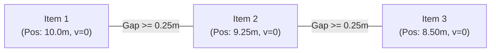

# Conveyor Kinematics & Accumulation

## Physical Conveyor Mechanics

Unlike pure queues where items occupy zero physical length, conveyors in `SimDES.jl` enforce physical spatial geometry and continuous movement along 1D paths:

1. **Path Length & Nominal Speed:** Each belt has length $L$ and velocity $v_0$. Free-flow transit time is $T_0 = L / v_0$.
2. **Product Dimensions & Headway:** Each entity possesses pitch $p$ (physical length) and safety gap $g$.
3. **Headway Constraint:** The distance between consecutive items $i$ and $i+1$ must satisfy:

$$d_i(t) - d_{i+1}(t) \ge p + g$$



---

## Conveyor Operating Modes

`SimDES.jl` provides three operating modes:

### 1. Free-Flow (`:free_flow`)
Items move continuously at constant velocity $v_0$. If the downstream station blocks, the belt halts or blocks the head item while trailing items continue until reaching the bottleneck.

### 2. Zero-Pressure Accumulation (`:accumulating` / ZPA)
Conveyor zones detect downstream blocking. When the lead item halts, subsequent items decelerate to zero velocity and stop behind it, maintaining the specified minimum safety gap without applying line pressure or colliding.

### 3. Indexing (`:indexing`)
The conveyor advances in discrete pulses of distance $\Delta x$ at fixed time intervals $\tau$.

---

## Configuring a Conveyor Zone

```julia
using SimDES

conveyor = ZoneConfig(
    id                      = 1,
    is_conveyor             = true,
    conveyor_mode           = :accumulating,
    path_length             = 12.0,      # meters
    nominal_speed           = 1.5,       # m/s
    conveyor_pitch          = 0.6,       # meters
    conveyor_gap            = 0.20,      # meters
    routing                 = FixedRoute(2),
)
```
